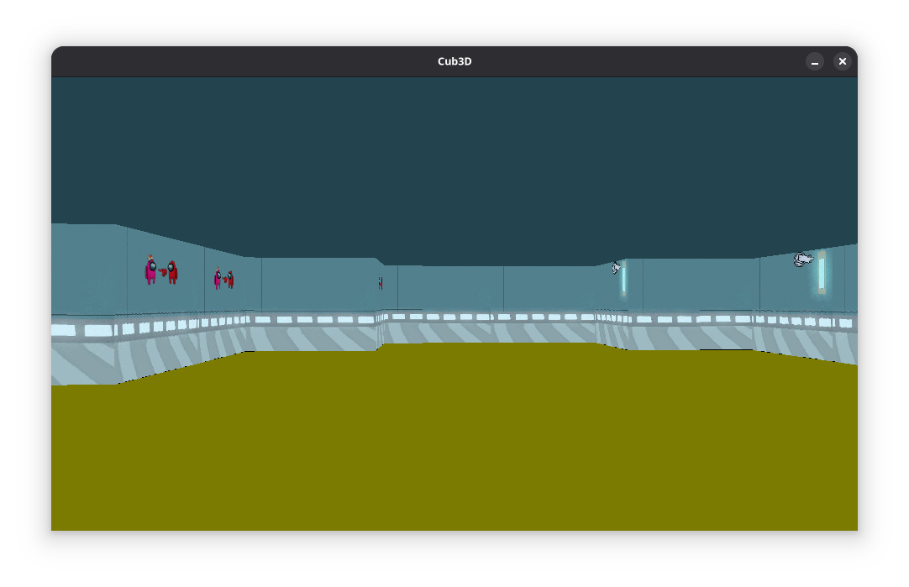

## Preview

## Usage
1. Clone this repository: `git clone git@github.com:asimetra/cub3d.git`
2. Change directory: `cd cub3d`
3. Install deps (Ubuntu/Debian): `sudo apt install -y libxext-dev libx11-dev`
4. Build: `make`
5. Run: `./cub3d config/test.map`

## Resource
- https://www.studyplan.dev/sdl2/vectors-and-movement
- https://lodev.org/cgtutor/raycasting.html
